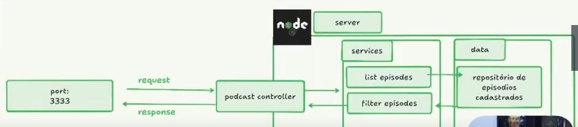

# Podcast Manager


### Descrição
Uma app ao estilo Netflix, onde possa centralizar diferentes episódios de podcasts separados por categorias.

### Domínio
Podcasts feitos em vídeo

### Features
- Listar os episódios de podcasts em sessões de categorias
    - [saúde, fitness, mentalidade, humor]
- Filtrar episódios por nome de podcast


## Como

#### Feature: 
Listar os episódios de podcasts em sessões de categorias

### Como vou implementar:
Retornar numa api rest (json), para que consiga alimentar um frontend, o nome podcast, nome do episódio, imagem de capa, link, categorias

GET: retorna lista de episódios

response:

```js
[
    {
        podcastName: "flow",
        episode: "CBUM - Flow #319",
        videoId: "pQSuQmUfS30",
        cover: "https://i.ytimg.com/vi/pQSuQmUfS30/maxresdefault.jpg".
        link:"https://www.youtube.com/watch?v=pQSuQmUfS30",
        categories:["health","sport","bodybuilder"]
    },
    {
        podcastName: "flow",
        episode: "RUBENS BARRICHELLO - Flow #339",
        videoId: "4KDGTdiOV4I",
        cover: "https://i.ytimg.com/vi/4KDGTdiOV4I/maxresdefault.jpg".
        link:"https://www.youtube.com/watch?v=4KDGTdiOV4I",
        categories:["sport","run"]
    }
]
```

GET: retorna lista de episódios baseado num parametro enviado pelo cliente do nome do podcast


NOTA: fazer esboço do projeto no tldraw


É necessário instalar o package "@types/node" para ser possível usar o http


OPÇÕES DE VISUALIZAÇÃO DO BACKEND
1. Usar browser --> colocar link http://localhost:3636/

2. Usar aplicação POSTMAN --> download https://www.postman.com/ --> permite "simular" o GET/POST enquanto o frontend não está terminado
INSTRUÇÕES:
- File - new file (ctrl+N)
- HTTP
- Selecionar método (GET/POST) e colocar o endereço, neste caso http://localhost:3636/
- lado direito - CODE SNIPPET --> escolher p.e. JavaScript - Fetch --> aparece o código para colocar no frontend

3. Usar extensão do VSCODE --> thunder client
- collections --> new collection --> new folder --> new request
- lado direito - Code Snippet --> escolher linguagem 


Como existem dois serviços diferentes (getListEpisodes, filterEpisodes), é necessário definir 2 rotas

endpoint + ? + parametros a passar no servidor   --> técnica de QueryString
http://localhost:3636/api/episode?p=flow